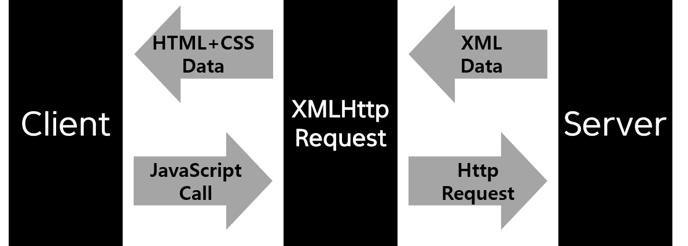

# AJAX(Asynchronous JavaScript And XML)

## 들어가기 전에...

1990년대까지 웹은 정적 환경이었다. **클라이언트가 서버로 요청**을 보내면, 서버는 **반드시 새로운 웹 페이지를 만들어 클라이언트에 보내야 한다.** 아주 작은 요청에도 새로운 페이지를 만들어야 하는 단점이 있다.

이를 해결하기 위해 만들어진 것이 `XMLHttpRequest`이다. `XMLHttpRequest`는 현재 대부분의 주요 웹 브라우저에 내장되어있는 객체로, **비동기 데이터 전송**을 도와준다. 이는 전체 페이지를 유지하며 필요한 데이터만 주고 받을 수 있도록 해준다.

비동기 웹 기술이 처음 나왔을때는 웹의 영향력이 미미하여 큰 관심을 끌지 못했다. 이후 구글이 액티브X나 플래쉬같은 플러그인 없이 구글맵을 구현하여 크게 주목 받기 시작했다(별도의 설치나 창의 호출 없이 브라우저 화면 안에서 이러한 서비스를 하는 것은 큰 충격이었다고 한다). 또한, Google Groups, Gmail 등에 비동기 웹 기술을 적용하였다. Google Page에 사용한 기술을 소개한 글에서 이러한 기술을 Ajax라고 소개하며 Ajax라는 용어가 처음 등장하였다.

 

## Ajax

Ajax는 Asynchronous JavaScript And XML의 약어이다. 자바스크립트를 통하여 XML(통신 데이터)를 비동기로 송수신 하는 것으로, 하나의 특정한 기술이 아닌 **기술의 묶음**이다. 넓은 의미로는 **페이지 새로고침 없이 비동기적으로 콘텐츠를 변경하기 위해 사용하는 모든 기술**을 의미한다. 간단히 말하면 **XMLHttpRequest 객체를 이용하여, 비동기 방식으로 서버와 데이터를 주고받는 것**이다.

#### 사용기술

* 표현 정보 : HTML([XHTML](https://ko.wikipedia.org/wiki/XHTML))과 CSS

* 동적 요소 : DOM과 자바 스크립트

* 데이터 포맷: [XML](https://ko.wikipedia.org/wiki/XML), [XSLT](https://ko.wikipedia.org/wiki/XSLT)(뿐만 아니라, 미리 정의된 HTML이나 일반 텍스트, [JSON](https://ko.wikipedia.org/wiki/JSON), [JSON-RPC](https://ko.wikipedia.org/wiki/JSON-RPC)를 이용할 수도 있다.)

  > 현재는 거의 JSON을 이용한다. 따라서 최근 Ajax는 약어가 아닌 고유명사처럼 쓰인다.

* 데이터 호출 :  XMLHttpRequset(XHR)객체

 

## 작동 방식

1. 웹 페이지에서 이벤트 발생(페이지로드, 버튼 클릭)
2. XMLHttpRequset 객체가 JavaScript에 의해 생성
3. XMLHttpRequset 객체가 서버에 요청(Request)
4. 서버가 요청 처리
5. 서버가 웹 페이지에 응답(Response)
6. XMLHttpRequest 객체가 응답 확인
7. JavaScript가 데이터 처리

기존 방식과 차이점은 클라이언트와 서버가 **전체 페이지가 아닌, 데이터만 주고 받는다**는 것이다. 결과적으로 클라이언트는 XML이나 JSON과 같은 형식 문서를 서버와 주고 받고, 그 결과만 클라이언트에서 출력해주기때문에 페이지의 새로고침 없이 일부분만 변경할 수 있다.

 

## 장점

* 고속으로 화면 전환 가능
* 비동기 요청 가능(서버를 기다리지 않는다 → 요청 후 다른 작업 수행 가능)
* 송신 데이터 양이 줄어든다 → 웹 서버 처리량도 줄어든다

 

## 단점

* 브라우저 호환성의 문제
* HTTP클라이언트 기능이 한정되어 있다
* 페이지 이동없는 통신을 하면 보안상의 문제가 생길 수 있다 
* 지원하는 Charset이 한정됨
* 디버깅이 어렵다
* 비동기 요청이기 때문에 요청이 너무 많아지면 서버 부하가 심해질 수 있다
* 동일-출처 정책으로 인해 다른 도메인과 통신이 불가능
  * 이를 해결하기 위한 방안으로 [CORS](https://github.com/Im-D/Dev-Docs/blob/master/Security/CORS(Cross-Origin%20Resource%20Sharing).md)가 있다.

> 동일-출처 정책(same-origin policy) : 웹 애플리케이션의 보안모델. 프로토콜(URI scheme), 호스트, 포트가 동일해야 한다는 제약 사항

 

## 한계

비동기식으로 요청을 하지만, 완전한 양방향 통신은 아니다. 요청에 응답한 뒤 세션이 종료되는 기존 HTTP프로토콜의 방식을 그대로 사용하기 때문이다. 이에 대한 대안으로 웹 소켓(Web Socket)이 등장하였다.

> 참고 - [HTTP2.0과 Web Socket](https://github.com/Im-D/Dev-Docs/blob/master/Browser/HTTP2_Websocket.md)

------

#### Reference

* [Ajax 시작하기 - MDN docs](https://developer.mozilla.org/ko/docs/Web/Guide/AJAX/Getting_Started)

* [웹사이트 접근의 새로운 혁명 Ajax](https://pringles.tistory.com/201)

* [[ Ajax 강좌 ] 1강. Ajax는 무엇일까요.](https://blog.nonamex.kr/5)

* [Ajax & CORS Overview](https://huns.me/development/1291)

* [Ajax - 생활코딩](https://opentutorials.org/course/1375/6843)

* [AJAX   Asynchronous Java Script and XML - 정보통신기술용어해설](http://www.ktword.co.kr/abbr_view.php?nav=2&id=1382&m_temp1=3571)

* [Ajax - 위키백과](https://ko.wikipedia.org/wiki/Ajax)

